# Azure 101: A Beginner's Guide to Microsoft Azure

Welcome to "Azure 101: A Beginner's Guide to Microsoft Azure." In this one-hour workshop, we will introduce you to the basics of Microsoft Azure, a cloud computing platform that offers a wide range of services to help individuals and organizations build, deploy, and manage applications and services through Microsoft's global network of data centers.

## What is Cloud computing?

Cloud computing is the distribution of computing services via the Internet (the cloud), including servers, storage, databases, networking, software, analytics, and intelligence, to provide faster innovation, more flexible resources, and economies of scale

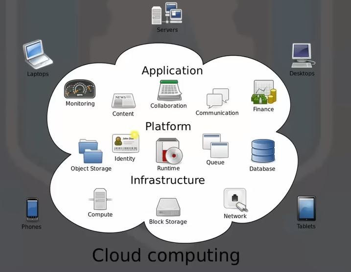

## What is Microsoft Azure?

Microsoft Azure is the company's public cloud computing platform. It offers a variety of cloud services, including computation, analytics, storage, and networking, allowing its users to pick and choose which ones they want to use to build and grow new applications or run old ones in the public cloud

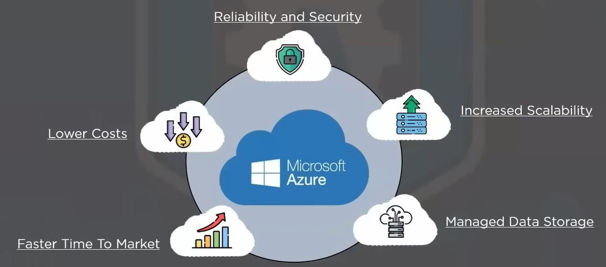

>The Azure platform is designed to assist organizations in overcoming obstacles and achieving their objectives. Its relevant services for various industries, including e-commerce, finance, and a wide range of businesses, and it is open-source compatible

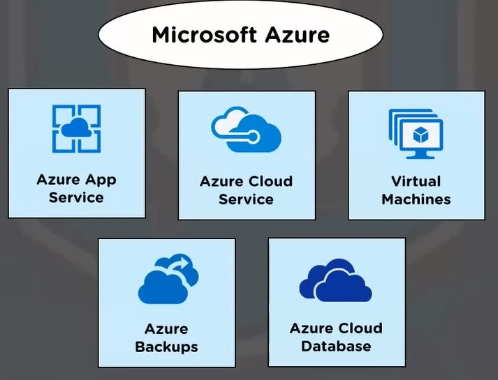

## How does Microsoft Azure Work?

Customers who subscribe to Azure get access to all the services available through the Azure interface. These services allow subscribers to create cloud-based resources such as virtual machines (VMs) and databases.

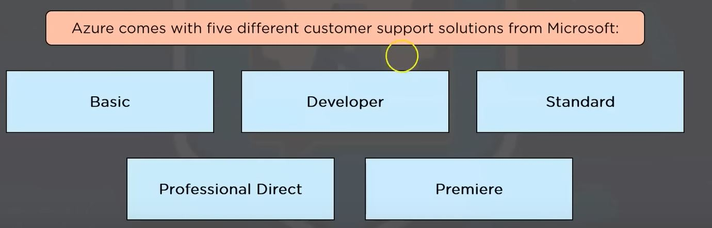

## What are the services that Azure offers?

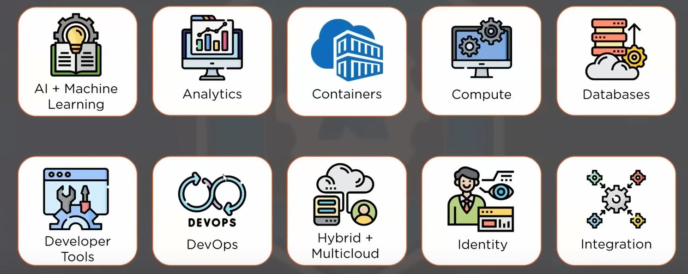
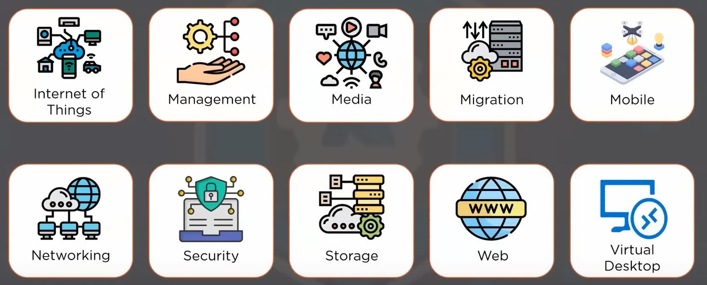
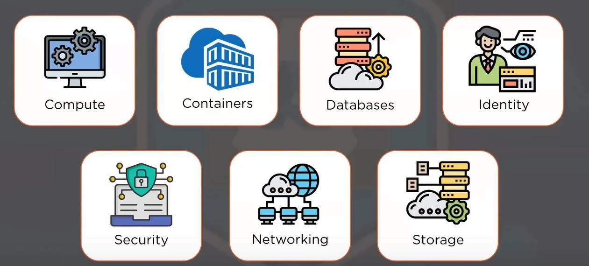
## Compute

Azure compute is a cloud computing solution that allows you to run cloud-based applications on demand. It provides on-demand computer resources that may often be made accessible in minutes or even seconds

Some of the most prominent services under Compute Service are:

### Azure Virtual Machines

You can construct and use virtual machines in the cloud using Azure Virtual Machines. Infrastructure as a service (laaS) is provided through virtual machines, which can be used in a variety of ways

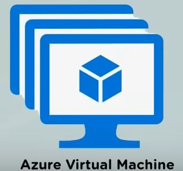

### Virtual Machine Scale Sets

Scale sets are an Azure compute resource that may be used to deploy and manage a group of identical virtual machines. Virtual machine scale sets are meant to provide real auto scale when all VMs are setup the same

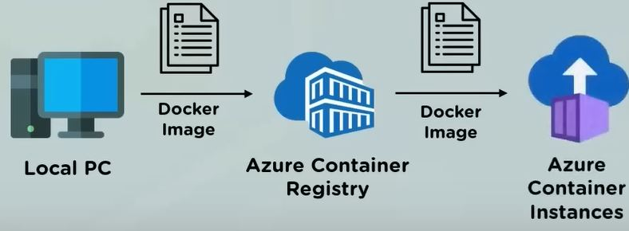

### Azure Container Instances

You can leverage Azure compute resources like Container Instances and Azure Kubernetes Service to deploy and manage containers. Containers are virtualized application environments that are lightweight

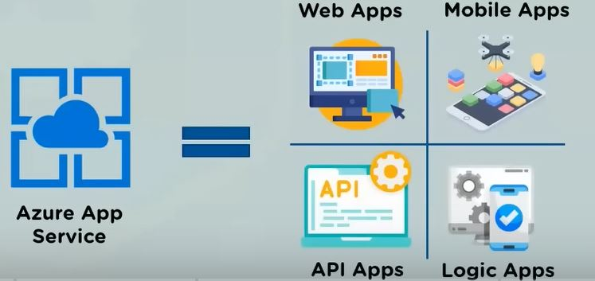

### Azure App Services

You can swiftly design, deploy, and scale enterprise-grade web, mobile, and API apps on any platform with Azure App Service. App Service is a PaaS (platform as a service) solution

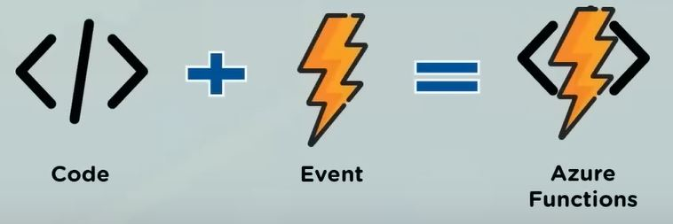

### Azure Functions

When you simply care about the code that runs your service and not the underlying platform or infrastructure, functions are great

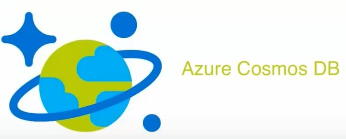

## Containers

A container is a typical software package that bundles an application's code with necessary configuration files and libraries, as well as the dependencies required for the app to execute

Some of the most prominent services under Containers are:
### Container Instances

Container Instances enable users to focus on their applications, by not having to manage virtual machines or learn how new tools work. The users' applications run in the cloud in a container

### Azure Container Services
Azure Container Services or Azure Kubernetes Services(AKS) allows users to manage, deploy and control operations of a Kubernetes container

### Container Registry
A Container Registry is used to ease container development by easing the storage and management of container images

## Databases
Microsoft has released a managed instance aimed at on-premises clients. So, if we have any SQL databases on-premises that we want to migrate to Azure without any complex configuration or ambiguity, we can use managed instance

Some of the most prominent services under Databases are:
### Azure Cosmos DB

Azure Cosmos DB is a multi-model, globally distributed database service. You may increase throughput and storage across any number of Azure locations around the world in an elastic and independent manner

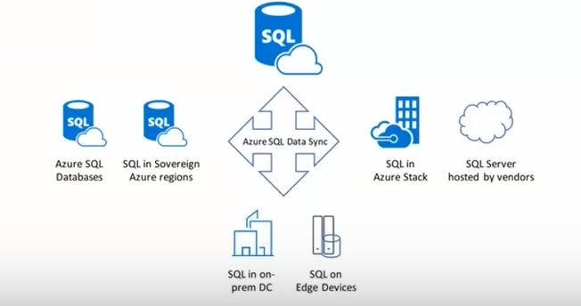

### Azure SQL Database
Azure SQL Database is a relational database based on the Microsoft SQL Server database engine's most recent stable version. SQL Database is a fast, dependable, well- managed, and secure database

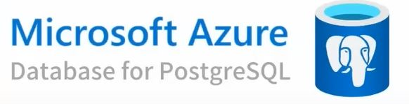

### Azure PostgreSQL

Azure Database for PostgreSQL is a cloud-based relational database solution. The server software is based on the open-source PostgreSQL database engine's community edition

## Security and Identity

Identity Management in specific is a process of authenticating first and then authorizing using security principles and it involves controlling information about those principal Identities

Some of the most prominent services under Security and Identity are:

### Azure Security Centre

The Azure Security Centre provides security management and provides threat protection across workloads that involve hybrid clouds
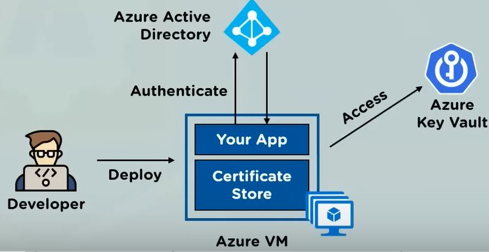

### Key Vault

Key Vault helps safeguard cryptographic keys and other secrets used by cloud applications and services

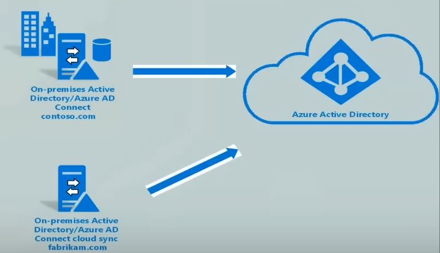

### Azure Active Directory
Azure AD helps users create intelligence driven access policies to limit resource usage and manage user identities

## Networking

Network Watcher, Express Route Monitor, Azure Monitor, or VNet Terminal Access Point are all Azure networking services that can be used to monitor your network resources (TAP)

Some of the most prominent services under Networking are:

### Virtual Network

Azure networks allow Azure services such as virtual machines, web apps, and databases to connect with one another, as well as with internet users and on-premises client devices
### VPN Gateway

A virtual network gateway (VPN gateway) is a form of virtual network gateway. Azure Virtual Network instances host Azure VPN Gateway instances
### ExpressRoute

With the support of a connectivity provider, Express Route allows you to expand your on-premises networks into the Microsoft cloud over a private connection

## Storage

Azure Storage is a Microsoft-managed cloud storage solution that offers high availability, security, durability, scalability, and redundancy. Whether it's photos, configuration files, or sensor data from an loT array, data needs to be stored in a form that's easy to access for analysis

### Azure Blob Storage

Blob Storage is a Microsoft Azure service for storing binary big objects (blobs) made up of unstructured
material like text, photos, and videos, as well as associated metadata

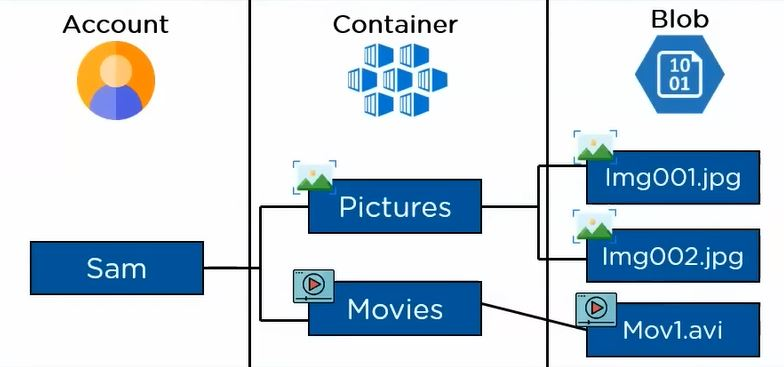

### Azure Table Storage
Table Storage in Azure is a scalable, NoSQL, key-value data storage system for storing huge amounts of data in the cloud. This storage solution is schema less, with rows made up of key-value pairs in each table

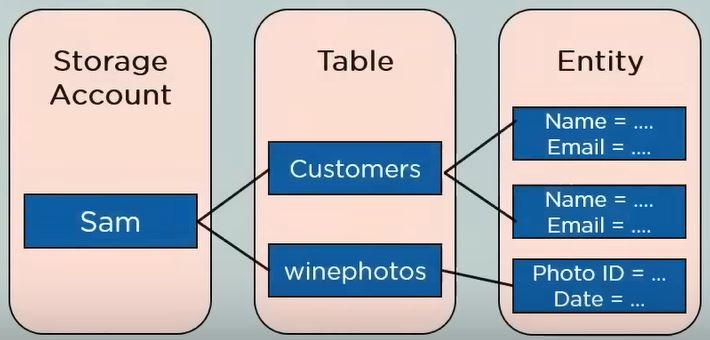

### Azure Queue Storage

Queues have been around for a long time, and their simple FIFO (first in, first out) architecture makes them a viable solution for storing non-ordered information

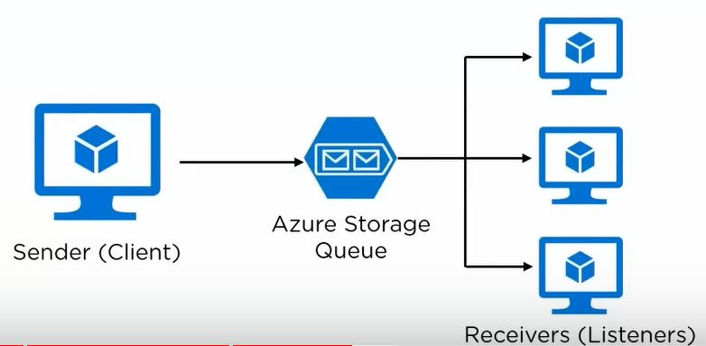

### Azure FIle Storage
Azure Files is a cloud-based shared network file storage solution that lets administrators access native SMB file shares

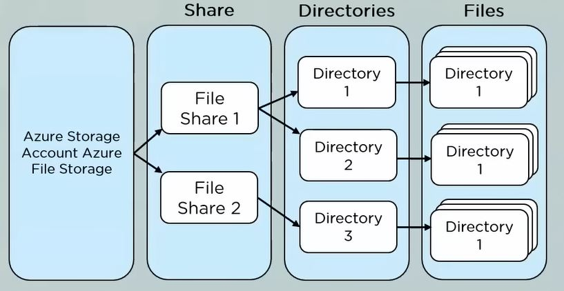

## How is Azure better than the others?

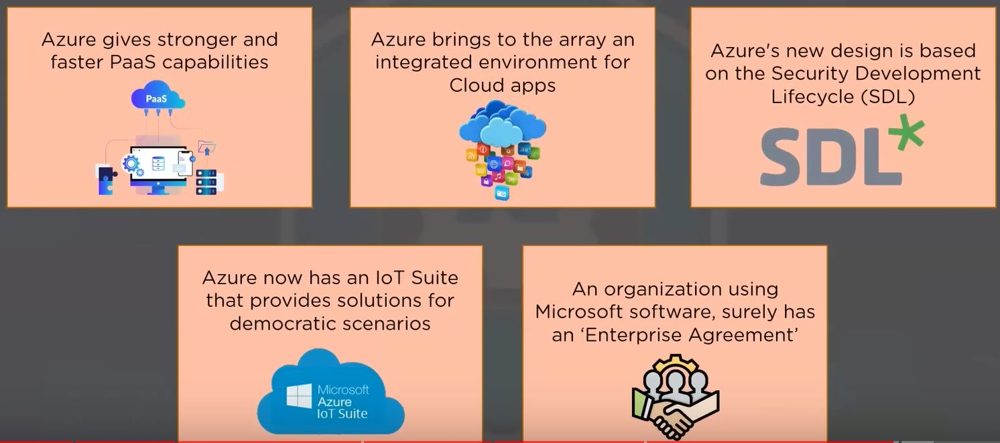

